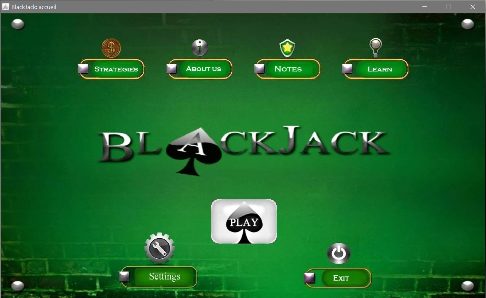
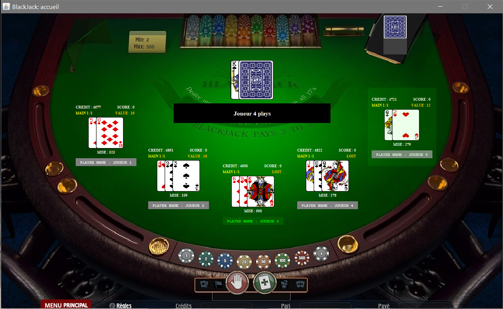

# blackjack
Jeu de blackjack en java mvc implémentant les patrons de conception suivant (design patterns):
- mvc
- fabrique
- façade
- usine
- itérateur
- observateur
- stratégie
- chaine de responsabilité

## Capture

